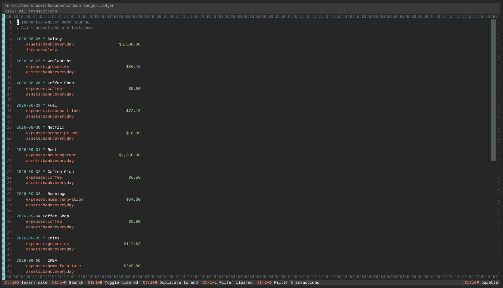

# ledgerkit-editor

[](https://github.com/ctosullivan/ledgerkit-editor/actions/workflows/ci.yml)

A keyboard-driven terminal editor for hledger plain-text accounting journals.

> **Early beta — use with caution.** This software is under active development and
> **may corrupt your journal files**. Always keep a backup before editing. Do not
> use on irreplaceable data without a recovery plan.

Built with [Textual](https://textual.textualize.io/) and
[ledgerkit](https://github.com/ctosullivan/ledgerkit).

---



## Features

- Full-screen text editor with hledger syntax highlighting (dates, payees, accounts,
  amounts, commodities, comments, directives — including `P` price directives,
  field-by-field)
- Monokai Pro default theme; runtime theme switching supported
- Incremental search with match highlighting (`Ctrl+F`, `Shift+PgUp/Down`,
  `Ctrl+C` to copy the current match)
- View filter — show all / cleared-only / unreconciled-only transactions (`Ctrl+L`)
- Transaction filter popup (`Ctrl+O`) — smart dates (named periods, quarters,
  relative offsets, month-name/year-month shorthand) plus substring-or-regex
  Account/Payee matching; combines with the `Ctrl+L` cycle rather than
  overriding it, and shows a visible/total transaction count while active
- Tab autocomplete for account and payee names, from declared directives plus
  everything already used in the journal — also available inside the `Ctrl+O`
  popup's fields
- Transaction block selection and duplication (`Ctrl+T`, `Ctrl+G`)
- Cleared status toggle — single transaction (3-state cycle) and bulk selection (`Ctrl+R`)
- Insert today's date at cursor (`Ctrl+D`)
- Date shifting with `Shift+Up` / `Shift+Down` (cursor-position-aware; works on
  transaction headers and `P` price directives; expands an unpadded date like
  `2026-9-1` to `2026-09-01` on first use)
- Save with date-sort and whitespace re-alignment (`Ctrl+S`)
- Undo / Redo (`Ctrl+Z` / `Ctrl+Y`)
- Command palette (`Ctrl+P`)

### Planned / In Progress

See [ROADMAP.md](ROADMAP.md) for the full, current status.

- `Alt+P` / `Alt+N` — insert previous/next matching transaction template
  (Emacs `ledger-mode` convention)
- `Shift+Alt+Up` / `Shift+Alt+Down` — increment/decrement date by one month
- `Ctrl+K` — delete to end of line
- Large-journal performance (10 000+ transactions without UI lag)
- Command palette: register all named actions
- Configurable keybinding profiles (MS Office / Emacs Ledger-mode stubs are in
  `src/ledgerkit_editor/keybindings/`)

---

## Installation

### From PyPI

```bash
pip install ledgerkit-editor
ledgerkit-editor path/to/my.journal
```

### Development setup

```bash
git clone https://github.com/ctosullivan/ledgerkit-editor.git
cd ledgerkit-editor

python -m venv .venv
.venv\Scripts\activate        # Windows
# source .venv/bin/activate   # macOS / Linux

pip install --upgrade pip
pip install -e ".[dev]"

# Run tests
pytest --tb=short

# Launch
ledgerkit-editor path/to/my.journal
```

---

## Journal File Resolution

The editor resolves the journal file in this order:

1. Path passed as a command-line argument
2. `$LEDGER_FILE` environment variable
3. `~/.hledger.journal` default
4. Interactive prompt on launch (if none of the above resolve)

---

## Keyboard Shortcuts

See [docs/shortcuts.md](docs/shortcuts.md) for the full reference.

---

## Requirements

- Python 3.9+
- textual 8.2.5
- ledgerkit 1.0.0.dev1

---

## Development

See [CONTRIBUTING.md](CONTRIBUTING.md) for setup instructions and the
ledgerkit dependency update workflow.

## Roadmap

See [ROADMAP.md](ROADMAP.md) for planned features and current development status.

---

## License

GPL-3.0-or-later. See [LICENSE](LICENSE) for the full license text and
[NOTICE](NOTICE) for the project's copyright notice. Runtime dependency
licenses are listed in [THIRD-PARTY-NOTICES.md](THIRD-PARTY-NOTICES.md).

---

> This repository was previously named `PyLedger-editor`. GitHub redirects
> old URLs automatically.
